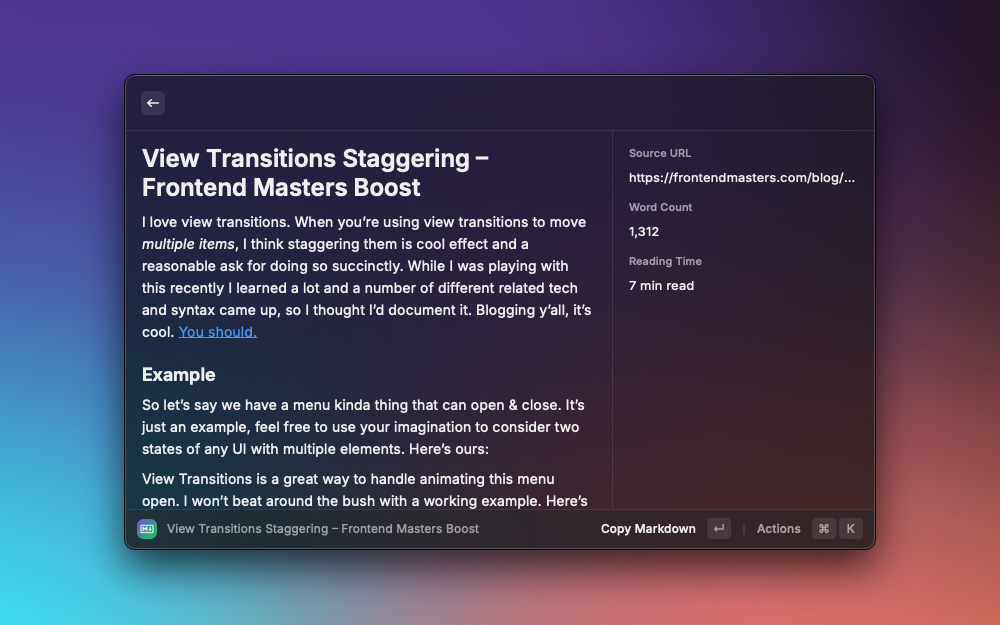

# Webpage to Markdown

Transform any webpage into clean markdown instantly. Perfect for content creators, developers, and note-takers who want to quickly convert web content into markdown format.

## Features

- Clean, instant conversion of web content to markdown
- Smart metadata tracking (word count, reading time)
- Automatic link collection and organization
- YAML front matter support for better organization
- Powered by Jina.ai's Reader API for reliable conversion

## Actions

- Copy markdown output (`↵`)
- Open original webpage (`⌘` + `↵`)

## Preferences

- Include metadata sidebar (word count, reading time, source URL)
- Add YAML front matter with metadata
- Include organized links summary at the end
- Add Jina.ai API key for higher rate limits
